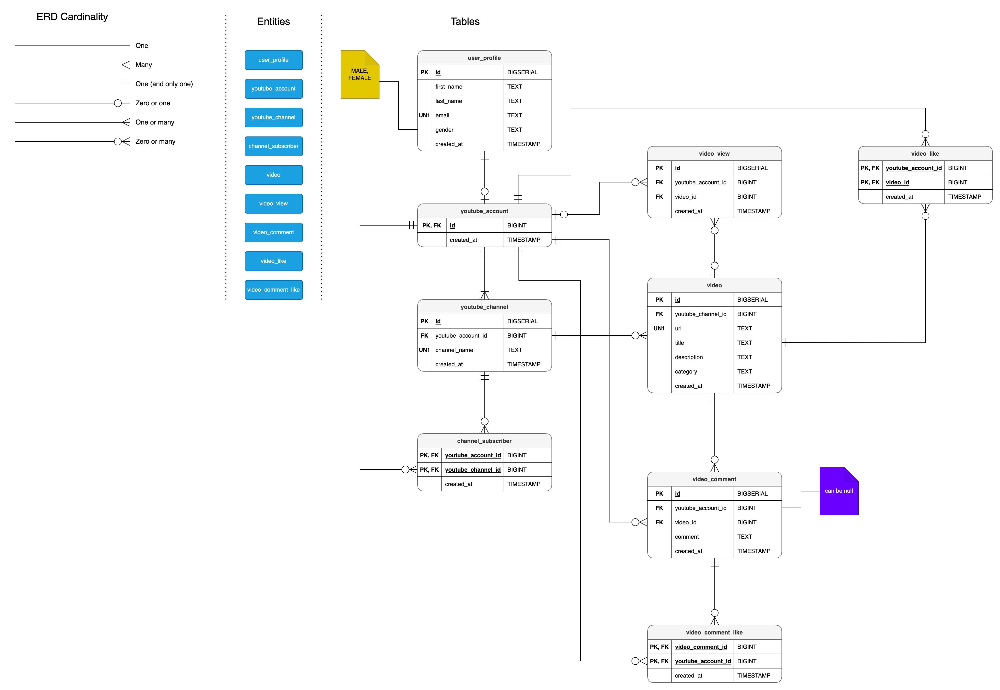

# Database design & implementation

The goal is to model a fraction of YouTube functionality to a PostgreSQL database architecture.

## Versions used

- PostgreSQL v14.6
- Postgres (mac) v2.6
- PgAdmin 4 v5.6
- IntelliJ DataGrip v2022.3.3

## ERD preview

